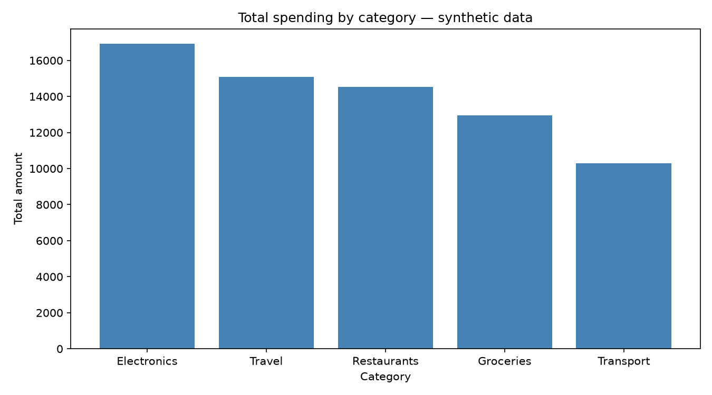
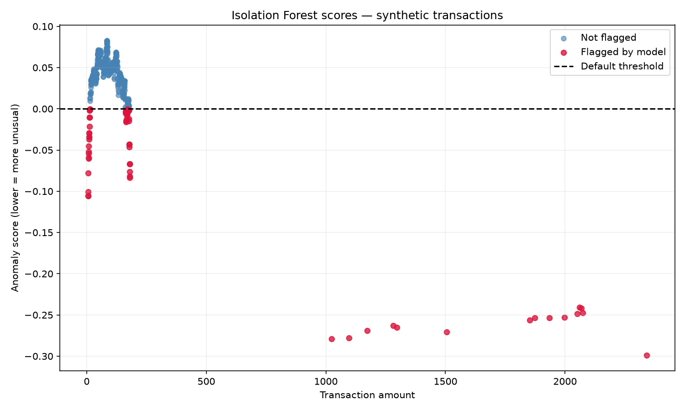

# Bank Transaction Analyzer

Python project for analyzing synthetic transactions using SQL and machine learning.

## Features

- CSV generation and SQLite import
- Spending analysis and charts
- Rule-based anomaly detection
- Isolation Forest with evaluation on separate test data

## Setup

```bash
python3 -m venv .venv
source .venv/bin/activate
python -m pip install -r requirements.txt
```

## Run

```bash
python src/generate_data.py
python src/load_to_sqlite.py
python src/analyze_transactions.py
python src/detect_anomalies.py
python src/detect_relative_anomalies.py
python src/plot_category_spending.py
python src/detect_ml_anomalies.py
python src/generate_data.py --seed 123 --output data/raw/test_transactions.csv
python src/evaluate_model.py
```

## Results

On 500 separate synthetic test transactions, threshold -0.15 detected all
25 generated anomalies with no false alarms. The default threshold produced
63 false alarms.

These synthetic amounts are clearly separated, so the results do not represent
real-world fraud detection performance.




Built as a learning project with AI assistance.
